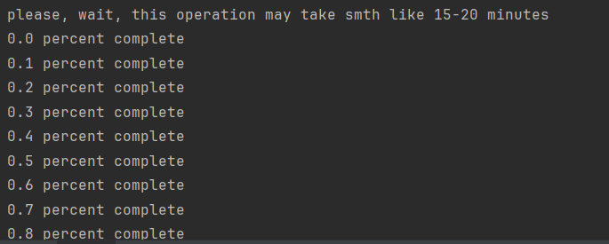

- Основные скрипты
  - `search_in_db.py` - поиск в базе данных.
    - Необходимо передать название файла с БД и ввести часть или полное название фильма, чтобы получить все варианты.
  Скрипт проверяет наличие БД, после этого происходит поиск фильмов в данной БД.
  После выполнения, скрипт выдает мн-во фильмов в названиях которых встречается искомый.
  
  - `make_own_db.py` - создание собственной БД
    - Необходимо передать ключ api. Затем формируется запрос. Если запрос неверен обрабатывается ошибка. 
    В переменной мы можем задать какое кол-во фильмов мы хотим получить. Как только указанное кол-во фильмов получено файл сохраняется в репозиторий. 
    
  
  - `hello_api_TMDB.py` - Найти бюджет фильма
     * Функция принимает ключ api. Затем формируется запрос. Если запрос неверен обрабатывается ошибка.
    Указываем номер фильма бюджет которого мы хотим найти.
  
  - `find_similar.py` - Позволяет получить рекомендации по фильмам, основанную на их рейтинге.  
    * Указываем файл в БД, также указываем фильм с которым будем сравнивать. После этого проверяется файл с бд и наличие в нем данного фильма.
        - Фильмы будут ранжироваться по следующим параметрам:
          - коллекция фильмов (id, название)
          - оригинальный язык
          - бюджет
          - жанр фильма
        - Происходит поиск по всем фильмам, что есть в БД и сравнения со значениями указанными в параметрах.
        - После окончания поиска из полученных данных удаляется изначально заданный фильм
        - Сортируется полученные значения по убыванию рейтинга
        - Выдается список рекомендуемых фильмов
# Запуск
Для начала запускаем файл `make_own_db.py` из файла .env() получаем api_key, получить этот ключ можно на сайте [здесь](https://www.themoviedb.org/settings/api) перед этим нужно зарегистрироваться. 
После необходимо булет подождать порядка 15-20 минут.

Необходимо подождать пока закончиться загрузка и у вас появиться БД

